# 上课笔记

记录了每周上课的笔记内容。

## 资料

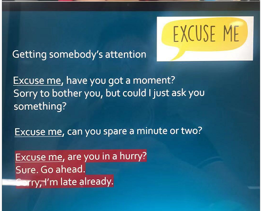

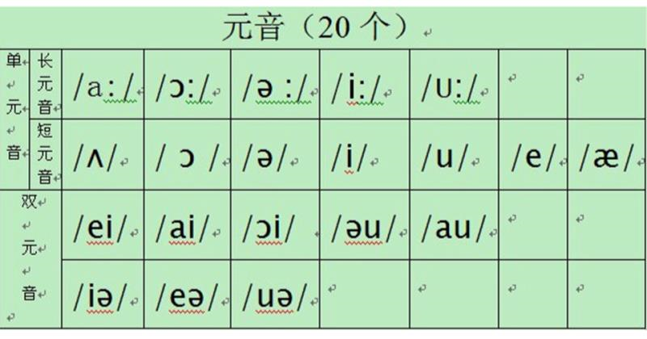

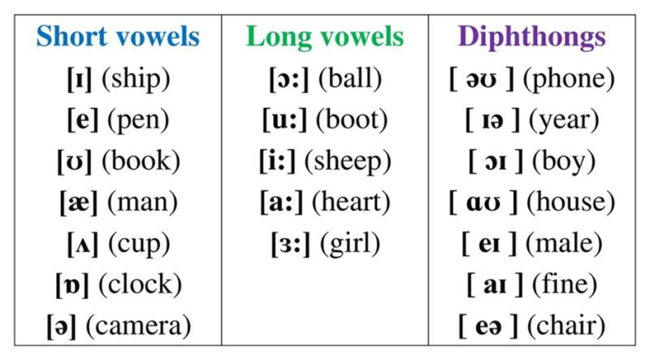

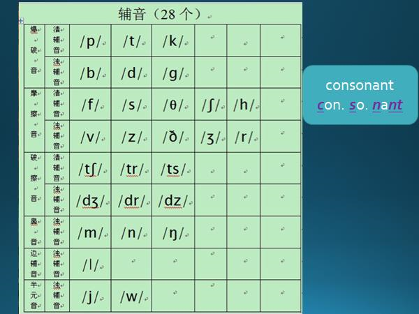

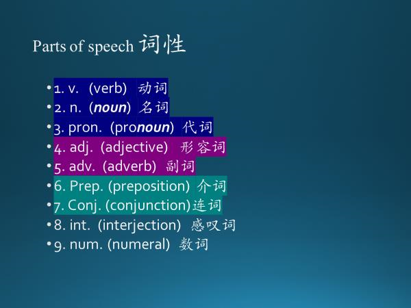

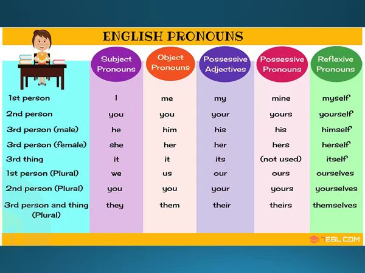

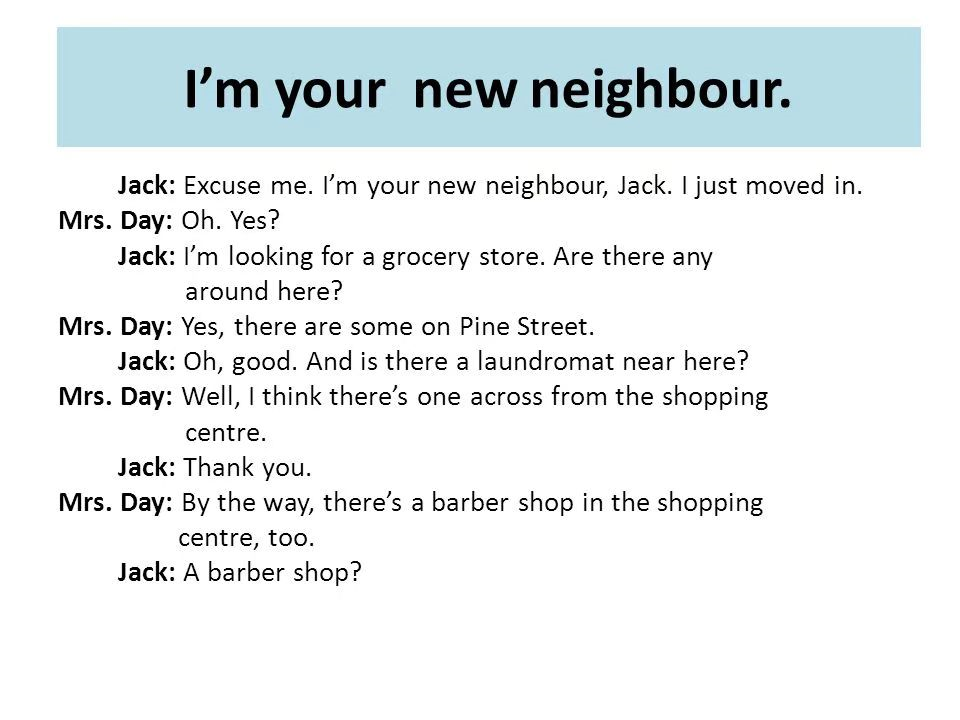

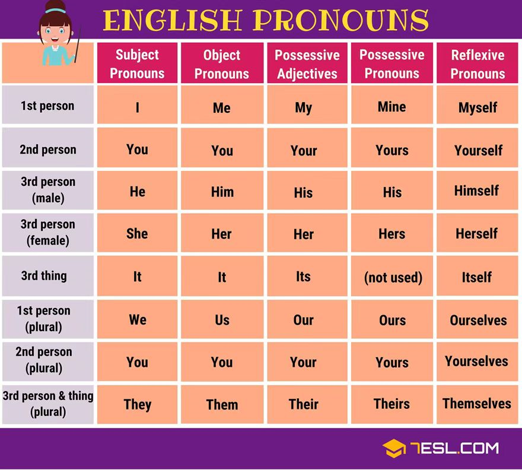

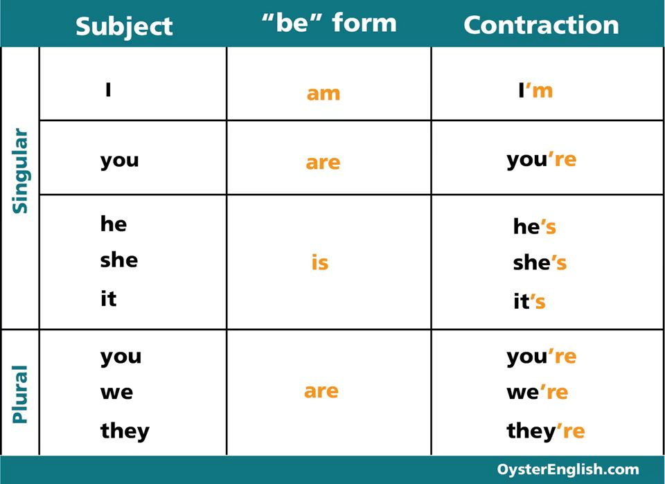

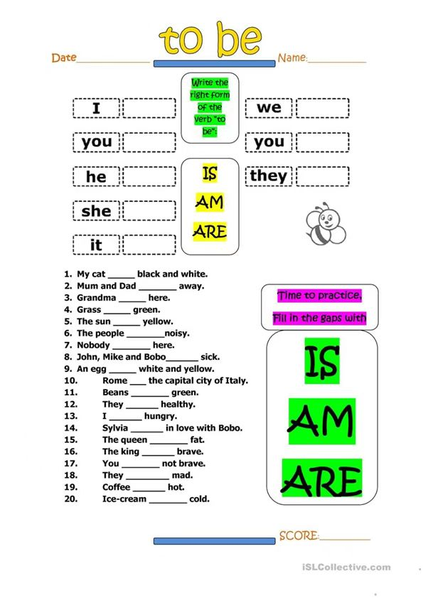

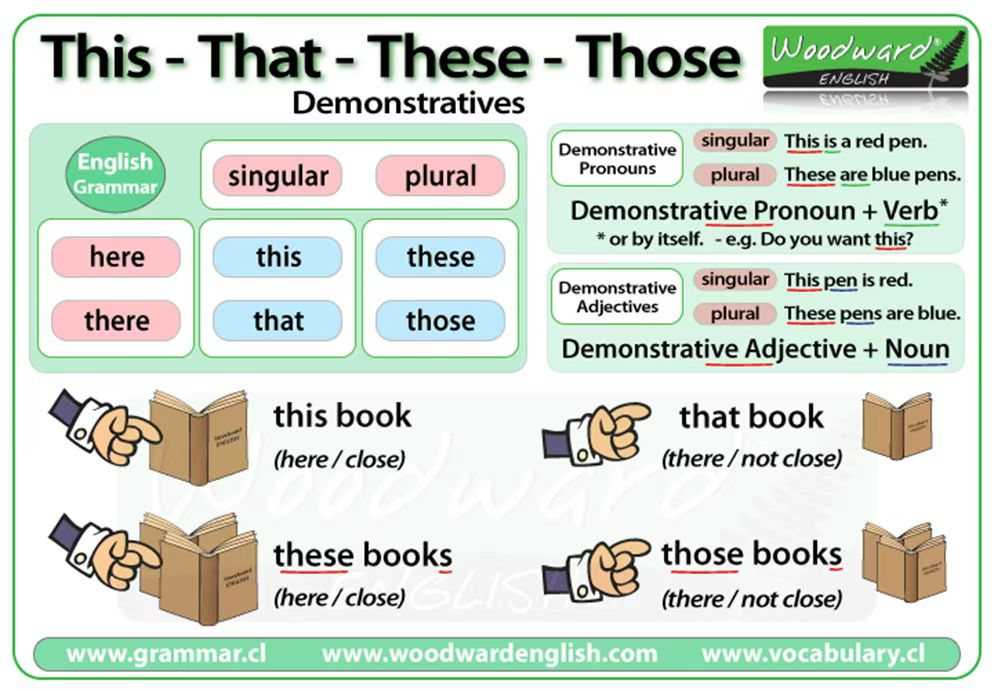

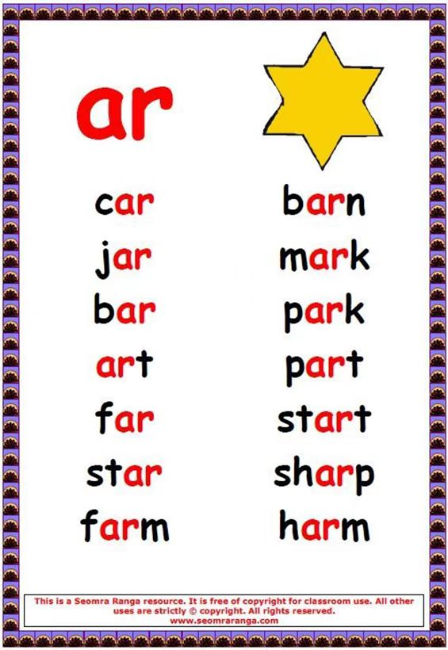

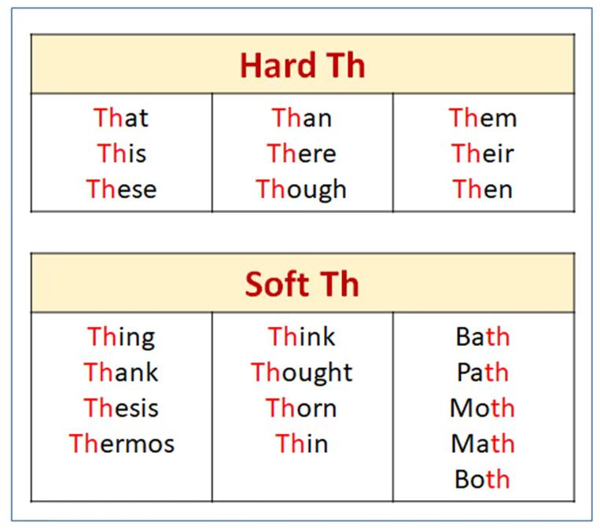

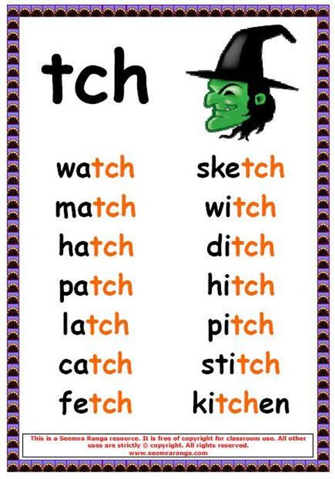

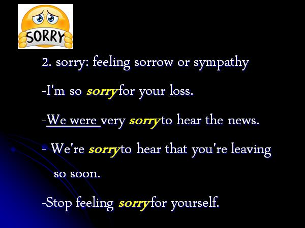

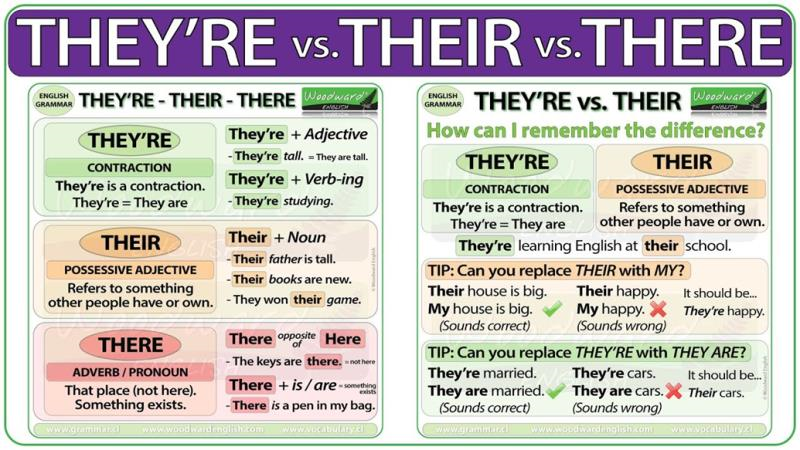

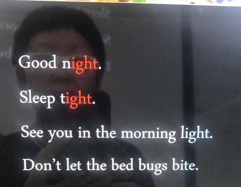

## 20210828-01

### 单词

| 单词 | 音标 | 释义 | 说明 |
| ---- | ---- | ---- | ---- |
|      |      |      |      |
|      |      |      |      |
|      |      |      |      |

