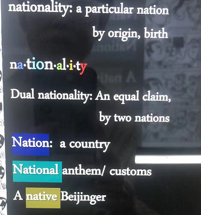
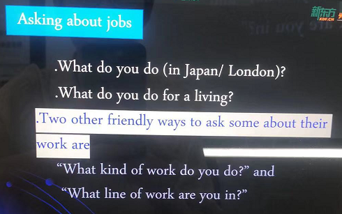

# 20210904-02 上课笔记


## 背诵句子

What make of car do you drive?


What <u>brand of coffee</u> do you drink?


I am a new student at <u>Cambridge University</u> studying education.


A：How are you, Miranda? I heard you were sick recently.

B：I'm feeling much better.


nice meeting you.（认识你真高兴，用于告别）


## 课件素材







```
《Woman Work》

I've got the children to tend
The clothes to mend
The floor to mop
The food to shop
Then the chicken to fry
The baby to dry

I got company to feed
The garden to weed
I've got shirts to press
The tots to dress
The can to be cut
I gotta clean up this hut
Then see about the sick
And the cotton to pick.

Shine on me, sunshine
Rain on me, rain
Fall softly, dewdrops
And cool my brow again.

Storm, blow me from here
With your fiercest wind
Let me float across the sky
'Til I can rest again.

Fall gently, snowflakes
Cover me with white
Cold icy kisses and
Let me rest tonight.

Sun, rain, curving sky
Mountain, oceans, leaf and stone
Star shine, moon glow
You're all that I can call my own.

```


