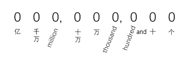

# 英文中的数词

基数词和序数词

## 基数词

one（一）；two（二）；three（三）；four（四）；five（五）；

six（六）；seven（七）；eight（八）；nine（九）；ten（十）；

eleven（十一）；twelve（十二）；

thir**teen**（十三）；four**teen**（十四）；==fif==**teen**（十五）；six**teen**（十六）；

seven**teen**（十七）；==eigh==**teen**（十八）；nine**teen**（十九）；

【teen（adj.）：十几岁的，青少年的；teen（n.）：青少年；】

twen**ty**（二十）；

twenty-one（二十一）；twenty-two（二十二）；twenty-three（二十三）；twenty-four（二十四）；

twenty-five（二十五）；twenty-six（二十六）；twenty-seven（二十七）；twenty-eight（二十八）；

twenty-nine（二十九）；

thir**ty**（三十）；thirty-one（三十一）；thirty-two（三十二）；...

for**ty**（四十）；forty-one（四十一）；forty-two（四十二）；...

fif**ty**（五十）；fifty-one（五十一）；fifty-two（五十二）；...

six**ty**（六十）；sixty-one（六十一）；sixty-two（六十二）；...

seven**ty**（七十）；seventy-one（七十一）；seventy-two（七十二）；...

eigh**ty**（八十）；eighty-one（八十一）；eighty-two（八十二）；...

nine**ty**（九十）；ninety-one（九十一）；ninety-two（九十二）；...

hundred（百，数词，做单数，不用加s）；

one hundred（一百）；two hundred（二百）；three hundred（三百）；four hundred（四百）；

five hundred（五百）；six hundred（六百）；seven hundred（七百）；eight hundred（八百）；

nine hundred（九百）；

thousand（千，数词，做单数，不用加s）

one thousand（一千）；two thousand（两千）；three thousand（三千）；four thousand（四千）；

five thousand（五千）；six thousand（六千）；seven thousand（七千）；eight thousand（八千）；

nine thousand（九千）；

英文中没有“万”这个单位，需要通过“千”进行换算。（1万=10千，2万=20千，10万=100千，20万=200千）

ten thousand（一万）；twenty thousand（二万）；thirty thousand（三万）；forty thousand（四万）；

fifty thousand（五万）；sixty thousand（六万）；seventy thousand（七万）；eight thousand（八万）；

ninety thousand（九万）；

one hundred thousand（十万，100千）；two hundred thousand（二十万，200千）；

three hundred thousand（三十万，300千）；four hundred thousand（四十万，400千）；

five hundred thousand（五十万，500千）；six hundred thousand（六十万，600千）；

seven hundred thousand（七十万，700千）；eight hundred thousand（八十万，800千）；

nine hundred thousand（九十万，900千）；

million（百万，数词时，只作单数，不加s）；

one million（一百万）；two million（二百万）；three million（三百万）；four million（四百万）；

five million（五百万）；six million（六百万）；seven million（七百万）；eight million（八百万）；

nine million（九百万）

英文中没有“千万”这个单位，表示”千万“时，通过million（百万）进行换算。（1千万=10百万；）

ten million（一千万，10百万）；twenty million（二千万，20百万）；thirty million（三千万，20百万）；

forty million（四千万，40百万）；fifty million（五千万，50百万）；sixty million（六千万，60百万）；

seventy million（七千万，70百万）；eighty million（八千万，80百万）；ninety million（九千万，90百万）；

英文中没有“亿”这个单位，表示“亿”时，通过million（百万）换算。（1亿=100百万）

one hundred million（1亿，100百万）；two hundred million（2亿，200百万）；

three hundred million（3亿，300百万）；four hundred million（4亿，400百万）；

five hundred million（五亿，500百万）；six hundred million（六亿，600百万）；

seven hundred million（七亿，700百万）；eight hundred million（八亿，800百万）；

nine hundred million（九亿，900百万）

三位数表示法：百位数 hundred and 十/个位数

999：nine hundred **and** ninety-nine（九百九十）

674：six hundred **and** seventy-four（六百七十四）

123：one hundred **and** twenty-three（一百二十三）

508：five hundred **and** eight（五百零八）

390：three hundred **and** ninety（三百九十）

四位数表示法：

千位数和百位数之间不用and，百位数和十位数之间依旧使用and。即：超过99的数字，在表示十位和个位的二位数时，如果这个二位树是介于1到99之间的，则必须使用and连接这个二位数）

1、只有千和百

3900：three thousand nine hundred（三千九百）

2、既有千和百，也有十位和个位：千位数 thousand 百位数 hundred and 十/个位数

9999：nine thousand nine hundred **and** ninety-nine（九千九百九十九）

2045：two thousand **and** forty-five（二千零四十五）

3008：three thousand and eight（三千零八）

拼读技巧：

按照逗号分隔，每三位以百位数的形式进行拼读，然后加上对应的单位即可。

例如数字235,786,481，先分别按照235、786、481这三个三位数进行拼读：

two hundred and thirty-five、seven hundred and eighty-six、four hundred and eighty-one，

然后将对应的单位填补上：

two hundred and thirty-five **million ** seven hundred and eighty-six **thousand** four hundred and eighty-one

1：one

81：eighty-one

481：four **hundred** and eighty-one

6,481：six **thousand** four hundred and eighty-one

86,481：eighty-six **thousand** four hundred and eighty-one

786,481：seven hundred and eighty-six **thousand** four hundred and eighty-one

5,786,481：five **million** seven hundred and eighty-six **thousand** four hundred and eighty-one

35,786,481：thirty-five **million** seven hundred and eighty-six **thousand** four hundred and eighty-one

235,786,481：two hundred and thirty-five **million** seven hundred and eighty-six **thousand** four hundred and eighty-one

## 序数词

first（第一）；second（第二）；third（第三）；

four**th**（第四）；fif**th**（第五）；six**th**（第六）；seven**th**（第七）；eigh**th**（第八）；nin**th**（第九）；ten**th**（第十）；eleven**th**（第十一）；twelf**th**（第十二）；

第十三 到 第十九，都是在基数词的基础上加**th**。

thirteen**th**（第十三）；fourteen**th**（第十四）；fifteen**th**（第十五）；sixteen**th**（第十六）；seventeen**th**（第十七）；eighteen**th**（第十八）；nineteen**th**（第十九）；

二十、三十、四十...九十，变为第二十、第三十、第四十...第九十，规律相同：

先将末尾的y，变为i，然后添加字母e和th。

twent**y**（二十）；=>twent**ie****th**（第二十）

thirt**y**（三十）；=>thirt**ie****th**（第三十）

fortieth（第四十）；fiftieth（第五十）；sixtieth（第六十）；seventieth（第七十）；eightieth（第八十）；ninetieth（第九十）；

第二十一 到 第二十九，十位用基数词，各位用序数词。

twenty-first（第二十一）；twenty-second（第二十二）；twenty-third（第二十三）；

twenty-fourth（第二十四）；twenty-fifth（第二十五）；twenty-sixth（第二十六）；

twenty-seventh（第二十七）；twenty-eighth（第二十八）；twenty-ninth（第二十九）；

thirty-first（第三十一）；thirty-second（第三十二）；... thirty-ninth（第三十九）；